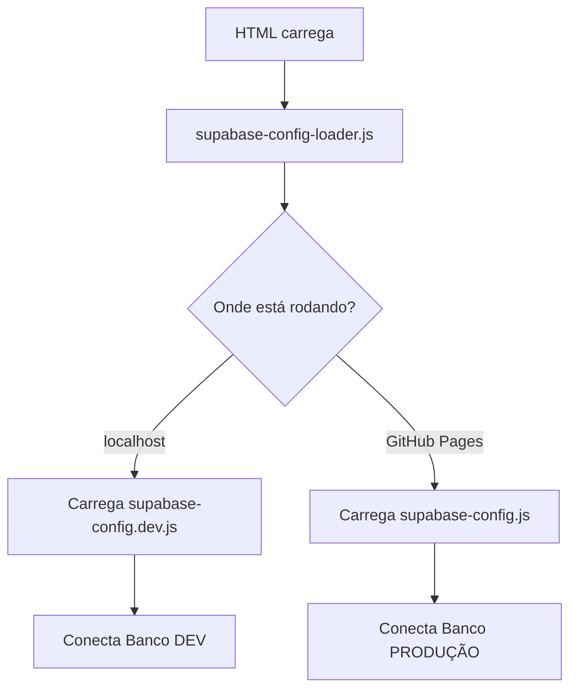

# 📋 RESUMO: SISTEMA DE AMBIENTES CONFIGURADO

## ✅ O QUE FOI FEITO

### 1️⃣ Sistema de Detecção Automática
- ✅ Criado `supabase-config-loader.js` que detecta automaticamente:
  - **localhost:8000** → Carrega banco DEV
  - **GitHub Pages** → Carrega banco PRODUÇÃO

### 2️⃣ Arquivos de Configuração
- ✅ `supabase-config.dev.js` - Credenciais DEV (gitignored)
- ✅ `supabase-config.js` - Credenciais PRODUÇÃO (vai pro GitHub)

### 3️⃣ Arquivos HTML Atualizados
Todos agora usam o loader automático:
- ✅ `index.html`
- ✅ `relatorio.html`
- ✅ `portal-colaborador.html`
- ✅ `colaborador.html`
- ✅ `admin-rh.html`
- ✅ `painel-rh/admin-rh.html`
- ✅ `primeiro-acesso.html`

### 4️⃣ Proteção de Credenciais
- ✅ `.gitignore` atualizado com `**/supabase-config.dev.js`

---

## 🎯 PRÓXIMOS PASSOS

### PASSO 1: Configure Credenciais DEV
```javascript
// Em: assets/js/supabase-config.dev.js
const SUPABASE_URL_DEV = 'COLE_SUA_URL_AQUI';
const SUPABASE_ANON_KEY_DEV = 'COLE_SUA_CHAVE_AQUI';
```

👉 Pegue no Supabase: **Settings → API**

### PASSO 2: Teste Local
```powershell
python -m http.server 8000
```
Abra: http://localhost:8000

**Você DEVE ver:**
- Badge laranja: `🔧 DESENVOLVIMENTO`
- Console (F12): `🗄️ Banco: https://seu-dev.supabase.co`

### PASSO 3: Teste Produção
Acesse: https://andersonb3.github.io/website-isiba/

**Você DEVE ver:**
- SEM badge laranja
- Console: `🗄️ Banco: https://kklhcmrnraroletwbbid.supabase.co`

---

## 📊 COMO FUNCIONA



---

## 🔐 SEGURANÇA

| Arquivo | Vai pro GitHub? | Contém |
|---------|----------------|--------|
| `supabase-config.js` | ✅ SIM | Credenciais PRODUÇÃO (seguro) |
| `supabase-config.dev.js` | ❌ NÃO | Credenciais DEV (protegido) |
| `supabase-config-loader.js` | ✅ SIM | Apenas lógica de detecção |

---

## 🎨 INDICADORES VISUAIS

### 🔧 Desenvolvimento (localhost)
- Badge laranja no canto da tela
- Console colorido: `🔧 AMBIENTE: DESENVOLVIMENTO`
- Debug habilitado

### 🌐 Produção (GitHub Pages)
- Sem badge
- Console: `🌐 AMBIENTE: PRODUÇÃO`
- Debug desabilitado

---

## 📁 ESTRUTURA FINAL

```
WEBSITE ISIBA/
├── assets/js/
│   ├── supabase-config-loader.js    ← Detecta ambiente
│   ├── supabase-config.dev.js       ← DEV (você configura)
│   └── supabase-config.js           ← PROD (já configurado)
├── database/
│   ├── RECRIAR-COLABORADORES-DEV.sql
│   ├── GERAR-INSERT-*.sql
│   └── ...
├── .gitignore                        ← Protege config.dev.js
├── CONFIGURAR-AMBIENTES.md          ← Guia completo
└── SETUP-RAPIDO-LOCAL.md            ← Guia rápido
```

---

## 🚀 BENEFÍCIOS

✅ **Separação Total**
- Local → DEV (teste à vontade!)
- GitHub → PRODUÇÃO (dados reais protegidos)

✅ **Automático**
- Detecta onde está rodando
- Carrega configuração correta
- Sem intervenção manual

✅ **Seguro**
- Credenciais DEV não vão pro GitHub
- Credenciais PROD são públicas (RLS protege)

✅ **Visual**
- Badge indica ambiente atual
- Console mostra qual banco está usando

---

## 📝 CHECKLIST FINAL

Antes de começar a trabalhar:

- [ ] Configurei `supabase-config.dev.js` com minhas credenciais
- [ ] Testei `localhost:8000` e vi badge laranja
- [ ] Console mostra banco DEV
- [ ] Testei GitHub Pages e NÃO vi badge
- [ ] Console mostra banco PRODUÇÃO
- [ ] Todos os 7 HTMLs foram atualizados

---

## 🎉 TUDO PRONTO!

Agora você pode:
1. ✅ Trabalhar localmente com banco DEV
2. ✅ Fazer commits sem medo
3. ✅ Push pro GitHub sem afetar produção
4. ✅ Testar funcionalidades novas
5. ✅ Quando estiver pronto, migrar pro PROD

**Sistema 100% funcional e seguro!** 🚀🔒
